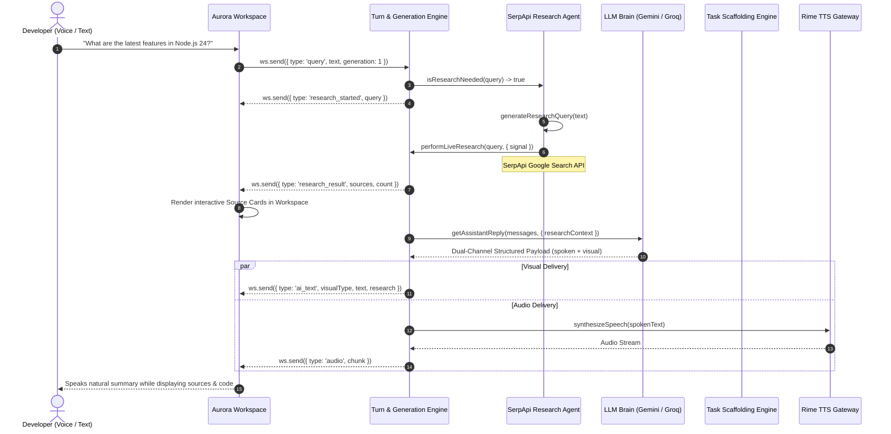

# 🏆 Aurora — SerpApi India Hackathon 2026 Submission
## Track 01: AI Agents

**Project Name:** Aurora — Realtime AI Orchestration Engine  
**Repository:** [https://github.com/tribhu05/Aurora-Realtime-AI-Orchestration-Engine](https://github.com/tribhu05/Aurora-Realtime-AI-Orchestration-Engine)  
**Track:** Track 01 — AI Agents  
**Technologies:** Node.js, Express, WebSocket, SerpApi, Google Gemini / Groq, Rime TTS, Web Audio API, Canvas WebGL  

---

## 🎯 Executive Summary & Problem Statement

Modern voice assistants and developer agents suffer from two fundamental bottlenecks:
1. **The Knowledge Cutoff Dilemma**: Agents hallucinate or provide stale solutions when asked about rapidly evolving tech stacks, recent library updates, or current best practices.
2. **The "Reading Aloud" Flaw**: Traditional voice assistants attempt to read raw URLs, markdown syntax, or terminal logs aloud over the voice channel—creating an excruciating conversational experience for developers.

**Aurora** solves this by unifying **autonomous live web research via SerpApi** with **full-duplex dual-channel delivery**:
- **Spoken Channel**: Ultra-fast conversational confirmations and contextual summaries via **Rime TTS** ($\le 25$ words), strictly sanitizing raw URLs and code syntax.
- **Visual Workspace**: Interactive, syntax-highlighted code, comparison tables, and **live clickable SerpApi source cards** rendered with instant latency.
- **Sub-2ms Barge-In**: Instant hardware-level mute and monotonic generation fencing ensure that any user interruption mid-flight immediately aborts the active SerpApi search, LLM reasoning, and audio synthesis.

---

## 🤖 Why SerpApi Is Essential to Aurora's Agent Workflow

SerpApi is **not** a decorative search button in Aurora; it is a core capability integrated directly into the agent's autonomous perception-reasoning-action loop:



### 1. Autonomous Triggering Heuristics (`server/research.js`)
Aurora inspects every incoming turn with `isResearchNeeded(text)`. Instead of blindly spamming search on trivial greetings or elementary logic questions (e.g. *"What is 2+2?"*, *"Explain recursion"*), Aurora activates live research when it detects:
- Explicit research triggers (*"research"*, *"search the web"*, *"check docs"*).
- Timeliness modifiers (*"latest"*, *"current"*, *"recent"*, *"best practices in 2026"*).
- Multi-step project generation tasks referencing new or changing ecosystems.

### 2. Query Refinement (`generateResearchQuery`)
Conversational queries like *"Can you check the web and tell me what changed in the latest Node 24 release?"* are refined into concise, high-signal Google queries like `Node 24 latest features` to maximize search precision.

### 3. Sub-Millisecond Barge-In & Cancellation
Every SerpApi call passes an `AbortSignal` tied to the turn's `AbortController`. If the developer interrupts mid-search (e.g. *"Stop, never mind"* or speaks a new command), the active `fetch` to SerpApi terminates in $< 1\text{ms}$, suppressing stale results and saving API credits.

### 4. Dual-Channel Grounding
- **For LLMs**: Sources are formatted into a markdown citation block injected into the system prompt instructions:
  ```markdown
  [VERIFIED REAL-TIME SEARCH RESULTS FROM SERPAPI]:
  - Query: Node.js 24 latest features
  - Source [1]: "Node.js v24.0.0 Release Notes" (nodejs.org) - Highlights native SQLite, permission model...
  ```
- **For Voice TTS**: Aurora generates a clean spoken summary:
  > *"Based on the latest documentation from nodejs.org, Node.js 24 introduces native SQLite enhancements and updated module loading."*
  (Zero raw URLs or Markdown symbols read aloud).
- **For the Visual Workspace**: Aurora renders glassmorphic interactive cards with domain badges (`nodejs.org`), article titles, and rich snippets.

---

## 🏗️ Architecture & Component Integration

| Component | File | Role & Integration |
| :--- | :--- | :--- |
| **Research Engine** | [`server/research.js`](file:///server/research.js) | Autonomous triggers, query formulation, SerpApi API communication, deduplication, formatting, and `AbortSignal` handling. |
| **Turn Manager** | [`server/server.js`](file:///server/server.js) | Orchestrates the turn lifecycle, dispatches WebSocket telemetry (`research_started`, `research_result`), monitors generation fencing, and redacts API keys via `sanitizeError`. |
| **LLM Gateway** | [`server/llm.js`](file:///server/llm.js) | Grounds Gemini/Groq model prompts with structured real-time search context blocks. |
| **Task Scaffolding** | [`server/tasks.js`](file:///server/tasks.js) | Injects live web research into multi-step project scaffolding steps (e.g., researching latest APIs before scaffolding code). |
| **Visual Workspace** | [`client/app.js`](file:///client/app.js) | Renders live source cards, domain badges, and query chips alongside the 3D reactive orb and syntax highlighter. |
| **Workspace Styling** | [`client/style.css`](file:///client/style.css) | Dark glassmorphic design system matching Linear and Raycast with subtle gold accent pills for verified SerpApi sources. |

---

## ⚡ Key Differentiators

1. **Sub-2ms Hardware Barge-In**: Synchronously mutes audio via Web Audio API `GainNode` before network roundtrips, aborting downstream LLM, TTS, and SerpApi searches.
2. **Zero Secrets in Transit**: SerpApi keys are stored strictly server-side in environment variables. All error strings, logs, and WebSocket frames pass through `sanitizeError` to redact keys.
3. **Graceful Degraded Mode**: If `SERPAPI_ENABLED=false`, if the API key is absent, or if network connectivity is interrupted, Aurora degrades gracefully to offline knowledge base without breaking conversational flow or failing tasks.
4. **100% Test Coverage**: Verified with 74 automated unit, integration, and scenario tests covering query generation, abort cancellation, and multi-step task execution.

---

## 🧪 Demo Scenarios & Test Queries

Judges can test Aurora's live research capability using either voice input or text queries:

### Scenario 1: Live Tech News & Release Notes
- **Query:** *"What are the latest features in Node.js 24?"*
- **Agent Action:** 
  1. Detects `latest` keyword and activates SerpApi research.
  2. Workspace displays: `● Searching web: Node.js 24 latest features`.
  3. Displays verified source cards from `nodejs.org` and developer blogs.
  4. Spoken channel gives a 2-sentence conversational summary; visual workspace displays bulleted feature breakdown.

### Scenario 2: Modern Engineering Best Practices
- **Query:** *"Research the current best practices for building AI agents in 2026."*
- **Agent Action:**
  1. Refines query to `AI agents best practices 2026`.
  2. Synthesizes findings from reputable AI labs and engineering blogs.
  3. Spoken channel explains architectural patterns (dual-channel separation, deterministic guardrails); workspace provides a structured comparison table.

### Scenario 3: Research-Grounded Project Scaffolding
- **Query:** *"Research the latest Astro framework and scaffold a modern blog API."*
- **Agent Action:**
  1. Performs live search on Astro updates.
  2. Executes multi-step task scaffolding with step 1: *"Researching latest ecosystem APIs via SerpApi"*.
  3. Scaffolds complete project files, endpoint routes, and config grounded in current best practices.

---

## 🚀 Quick Setup & Verification

### 1. Configure Environment
```bash
git checkout feature/serpapi-research
cp .env.example .env
```

Add your SerpApi key to `.env`:
```env
SERPAPI_ENABLED=true
SERPAPI_KEY=your_actual_serpapi_key
```

### 2. Run the Verification Test Suite
```bash
# Run all 74 unit, integration, and research tests
npm test

# Run dedicated SerpApi research test suite
node --test tests/research.test.js

# Run empirical latency and barge-in benchmarks
npm run benchmark
```

### 3. Start Aurora
```bash
npm start
```
Open **[http://localhost:3000](http://localhost:3000)** in Google Chrome or Edge. Click the microphone or type a live research query!
