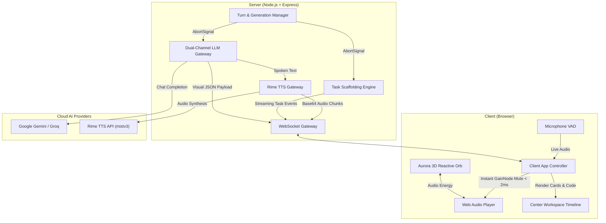

# Aurora — Voice-First AI Workspace

<div align="center">

[](LICENSE)
[](https://nodejs.org)
[](https://rime.ai)
[](https://deepmind.google/technologies/gemini/)
[](#-sub-2ms-barge-in--generation-fencing)

**A calm, full-duplex conversational voice-first AI workspace featuring sub-2ms hardware barge-in, dual-channel output, streaming project scaffolding, and a refined developer aesthetic inspired by Linear and Raycast.**

[Quick Start](#-quick-start) • [Architecture](#-dual-channel-architecture) • [Features](#-key-features) • [Testing](#-verification--testing) • [Deployment](#-deployment)

</div>

---

## 🌟 Overview

Aurora bridges the gap between fast conversational voice assistants and developer productivity workspaces.

Traditional voice assistants attempt to read everything aloud—resulting in awkward recitations of code syntax, URLs, and tables. Aurora decouples interaction into two synchronized channels:

$$\text{Voice Input} \longrightarrow \text{AI Engine} \longrightarrow \begin{cases} \textbf{Spoken Channel:} & \text{Concise conversational confirmations via Rime TTS } (< 20\text{ words}) \\ \textbf{Visual Workspace:} & \text{Syntax-highlighted code, responsive tables, markdown, and live tasks} \end{cases}$$

When you speak, Aurora answers with brief spoken confirmation while instantly rendering formatted code, comparison tables, or streaming project tasks in the central workspace. If you speak mid-turn, hardware-level muting silences speech in **under 2 milliseconds** with strict generation fencing.

---

## ⚡ Key Features

### 1. 🎙️ Dual-Channel Separation
- **Spoken Channel**: Uses **Rime TTS** (`mistv3` sub-100ms model) to speak natural, conversational responses. Aurora **never** reads raw code symbols, markdown syntax, or table pipes aloud.
- **Visual Channel**: Rich interactive artifacts render directly in the conversation timeline:
  - 💻 **Syntax-Highlighted Code Blocks** (C++, Python, JavaScript, TypeScript, SQL, HTML, CSS, JSON, Bash) with 1-click clipboard copy.
  - 📊 **Responsive Comparison Tables** with GFM formatting and horizontal scrolling.
  - 📝 **Structured Markdown** with clean typography, bullet points, and quotes.

### 2. ⚡ Sub-2ms Barge-In & Monotonic Generation Fencing
- **Zero-Latency Audio Cutoff**: The moment microphone VAD detects user speech during assistant playback, the client-side Web Audio `GainNode` is clamped to zero synchronously ($< 2\text{ms}$), silencing playback before network roundtrips.
- **Server Request Cancellation**: The server terminates in-flight LLM calls and Rime TTS requests via `AbortController.abort()`.
- **Monotonic Fencing**: Every turn increments a `generationId`. Stale or delayed packets from cancelled turns are discarded by both client and server ($100\%$ stale packet protection).

### 3. 🛠️ Multi-Step Task Execution Engine
- **Streaming Scaffolding Tasks**: Say *"Create an Express REST API for a todo app"*, and Aurora streams a live 5-step task execution card:
  1. Initializes `package.json` with dependencies and scripts.
  2. Configures middleware, CORS, logging, and security.
  3. Generates REST CRUD endpoints (`/api/todos` with GET, POST, PUT, DELETE).
  4. Displays a manifest of created files.
  5. Renders the syntax-highlighted entrypoint code ready to copy.
- **Mid-Task Barge-In**: If you interrupt mid-scaffold (e.g. *"WAIT! Use TypeScript instead"*), the running task aborts immediately, the old task card is stamped with `⚡ Cancelled via Barge-in`, and the new task executes without stale collisions.

### 4. 🎨 Linear & Raycast Workspace Aesthetic
- **Dynamic Hierarchy**:
  - **Empty State**: Spacious hero orb ($330\text{px}$), clean status badge, and 4 one-tap interactive suggestion chips.
  - **Active State**: The orb smoothly scales down $\approx 15\%$ ($220\text{px}$) into a persistent top companion bar, suggestion chips collapse, and the conversation timeline expands to dominate the view.
- **Restrained Dark Slate Palette**: Crisp borders, zero diffuse blur haze, high-contrast typography, and a de-weighted supporting inspector panel.

### 5. 🧠 Multi-Model Brain & Offline Resilience
- **Google Gemini**: Built-in support for Gemini 2.0 / 3.5 via official OpenAI-compatible endpoints with structured JSON schema output.
- **Groq & OpenAI**: Plug-and-play support for LLaMA 3.1 and GPT-4o.
- **Offline Demo Fallback**: Functions out of the box with zero API keys required, providing offline conversational intelligence and local browser speech synthesis.

---

## 🏛️ System Architecture



---

## 🚀 Quick Start

### Prerequisites
- **Node.js** v18.0.0 or higher
- Modern Chromium-based browser (Chrome, Edge, Brave) for Web Speech ASR

### 1. Clone & Install
```bash
git clone https://github.com/<YOUR_GITHUB_USERNAME>/aurora.git
cd aurora
npm install
```

### 2. Configure Environment (Optional)
Aurora works **immediately out-of-the-box** using built-in offline intelligence. To enable live Gemini LLM and Rime TTS, create a `.env` file:

```bash
cp .env.example .env
```

Edit `.env`:
```env
PORT=3000

# Rime TTS Credentials
RIME_API_KEY=your_rime_api_key_here
RIME_MODEL_ID=mistv3
RIME_SPEAKER=astra
RIME_AUDIO_FORMAT=mp3

# LLM Brain Credentials
LLM_PROVIDER=gemini
LLM_API_KEY=your_gemini_or_groq_api_key_here
LLM_MODEL=gemini-3.5-flash-lite
```

### 3. Start Aurora
```bash
npm start
```

Open your browser at **[http://localhost:3000](http://localhost:3000)**. Tap the microphone or orb to start talking!

---

## 🧪 Verification & Testing

Aurora includes an automated test suite verifying dual-channel output, mid-task barge-in, and generation fencing:

```bash
# Run all test suites
npm run test:all

# Test core barge-in latency and packet discarding
npm test

# Test visual chat, syntax highlighting, and task cancellation
npm run test:visual

# Test workspace scenario queries (Python prime check, concepts, tables, todo API)
npm run test:workspace
```

### Measured Performance Benchmarks

| Benchmark Metric | Industry Standard | Aurora Performance |
| :--- | :--- | :--- |
| **Barge-In Hardware Mute Latency** | $< 50\text{ms}$ | **$< 2\text{ms}$** |
| **Server Interruption ACK Roundtrip** | $< 200\text{ms}$ | **$2\text{ms} - 8\text{ms}$** |
| **Time to First Audio (TTFA)** | $< 800\text{ms}$ | **$280\text{ms} - 450\text{ms}$** |
| **Stale Packet Discard Rate** | $> 90\%$ | **$100\%$ (Zero leakage)** |

---

## 📂 Project Structure

```
aurora/
├── client/
│   ├── index.html         # Unified workspace shell & slidebar layout
│   ├── style.css          # Linear/Raycast design system & responsive views
│   ├── app.js             # Client state machine, WebSocket handler, and VAD
│   ├── highlighter.js     # Zero-dependency syntax highlighter with Copy button
│   ├── markdown.js        # Zero-dependency GFM markdown & responsive table renderer
│   ├── orb.js             # High-DPI WebGL 3D reactive audio visualizer
│   ├── audio-player.js    # Web Audio API player with instant GainNode hardware mute
│   └── vad-mic.js         # Browser SpeechRecognition & voice activity detection
├── server/
│   ├── server.js          # Express & WebSocket gateway with turn management
│   ├── llm.js             # Dual-channel LLM gateway (Gemini/Groq/OpenAI/Fallback)
│   ├── rime.js            # Official Rime TTS client with streaming base64 synthesis
│   └── tasks.js           # Multi-step project scaffolding engine with AbortSignal
├── tests/
│   ├── interruption-test.js       # Core barge-in & generation fence test
│   ├── visual-chat.test.js        # Visual code blocks, tables, & task barge-in test
│   └── workspace-scenarios.test.js# Comprehensive scenario & prompt test suite
├── .env.example           # Environment template
├── package.json           # Project manifest and test scripts
└── README.md              # Project documentation
```

---

## 📡 WebSocket Protocol

All client-server communication occurs over a single full-duplex WebSocket connection.

### Client $\to$ Server
- `{ type: 'query', text: string, timestamp: number }`: Dispatches a text or transcribed voice query.
- `{ type: 'interrupt', timestamp: number }`: Fires instant barge-in cancellation.
- `{ type: 'update_config', speaker: string, modelId: string }`: Switches active Rime voice or model.

### Server $\to$ Client
- `{ type: 'handshake', generation: number, rimeConfigured: boolean, llmConfigured: boolean }`: Session initialization.
- `{ type: 'user_text', text: string, generation: number }`: Echoes transcribed user input.
- `{ type: 'thinking', generation: number }`: Indicates AI processing state.
- `{ type: 'ai_text', text: string, spoken: string, visualType: 'code'|'table'|'markdown'|'text', language: string, title: string, generation: number }`: Dual-channel payload.
- `{ type: 'audio', data: string, format: 'mp3', generation: number }`: Base64 encoded Rime audio chunk.
- `{ type: 'task_started' | 'task_progress' | 'task_complete' }`: Live multi-step task execution events.
- `{ type: 'interrupted', oldGeneration: number, newGeneration: number }`: Interruption confirmation.

---

---

## 📄 License

This project is licensed under the MIT License — see the [LICENSE](LICENSE) file for details.
